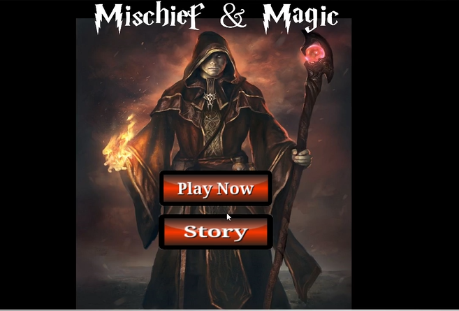

# Mischief-Magic

# •	Story
Long ago, the four nations lived together in harmony. Then, everything changed when all the nations attacked the Fire Kingdom. You are a powerful wizard of the Fire nation who is in search of his magic fire taken away by the kingdoms. Without that fire, you are weak and powerless. The fire is hidden in one of the 3 kingdoms. You must travel to each one of them and search for it or else you will lose all your powers. You will have to fight enemies that are sent to stop you from your mission. Since you are weakened by the loss of fire, any time enemy touches you, you die. Since you have a little bit of power left, you can use two types of attacks- fire bolt and fire sphere. Since fire sphere takes a lot of your energy, you are unable to use it again and again. You need to rest a bit for it to recharge. Your aim is to find the portal to the next world and search for your ‘Fire’. The fate of Fire Nation rests on your shoulders. Good Luck!

# •	Character design
The main character in the story is the wizard who is in search of his ‘Fire’. He will be travelling around looking for a way to get it back. Once he gains it, he can restore peace and prosperity among the people of his kingdom. However, since no good game is complete without obstacles, we’ve added some enemies sent by other kingdoms to stop the wizard from gaining back his powers. These characters are known as ‘Knights of Darkness’. They have the power to suck life out of a person by just touching them. Throughout the game, they will aim to get close to our wizard and kill him by touching him.

# •	Target Audience 
Our target audience will be teenagers and young adults. Since the story of the game is inspired from the famous anime “Avatar: The Last Airbender”, we think that it will be popular among the youth. The game play is easy enough for young teenagers and yet engaging enough for our older audience. Though the game is suitable for all age groups, we recommend Parental Guidance for children under 11 years of age because of the mild violence in the game (The wizard shoots bolt that kills the enemies).

# •	References
Even though the idea of the game is original, we do draw inspirations from existing game works and stories. As mentioned above, the main plot of the game is loosely based on the anime ‘Avatar: The Last Airbender’. The basic layout of the game is inspired from the game ‘Clash of Clans’, though ours is a lot less detailed (No budget or time). The wizard attacks have been inspired from the Prince of Persia game (Shooting arrows in all the direction and then recharging before using it again). Simple inspirations have been drawn upon from various games we played as a kid

# •	Game graphics

GIF created with [LiceCap](http://www.cockos.com/licecap/).

# •	Notes
It was hard to create the storm of attack without moving the Wizard. We used trignometric formulas to figure out how to do that. 
Setting the screen and moving from one screen to the other using a portal was challenging as well.

# •	License

    Copyright 2018  Venika Gaur

    Licensed under the Apache License, Version 2.0 (the "License");
    you may not use this file except in compliance with the License.
    You may obtain a copy of the License at

        http://www.apache.org/licenses/LICENSE-2.0

    Unless required by applicable law or agreed to in writing, software
    distributed under the License is distributed on an "AS IS" BASIS,
    WITHOUT WARRANTIES OR CONDITIONS OF ANY KIND, either express or implied.
    See the License for the specific language governing permissions and
    limitations under the License.
